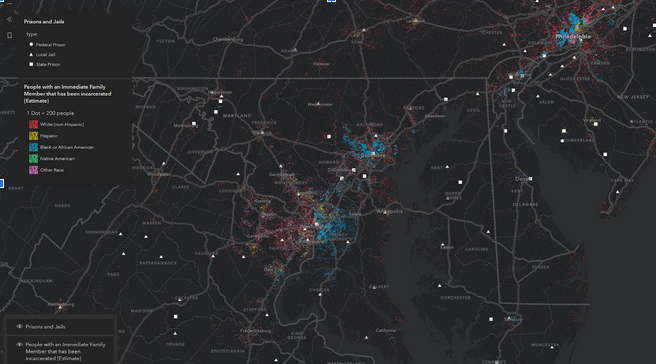

## Portfolio

---

### Projects

---
[Web GIS](https://alicias.io/)
Interactive GIS Maps and Applications utilizing different methods and techniques. I have about four years of experiene using different applications and programming languages to creatie interactive web maps.

[]

---
### Other Data Vizualizations
In addition to mapping I will occasionally produce other types of visualizations, mostly using JavaScript and R.

[]

---

Page template forked from <a href="https://github.com/evanca/quick-portfolio">evanca</a>

<!-- Remove above link if you don't want to attibute -->
