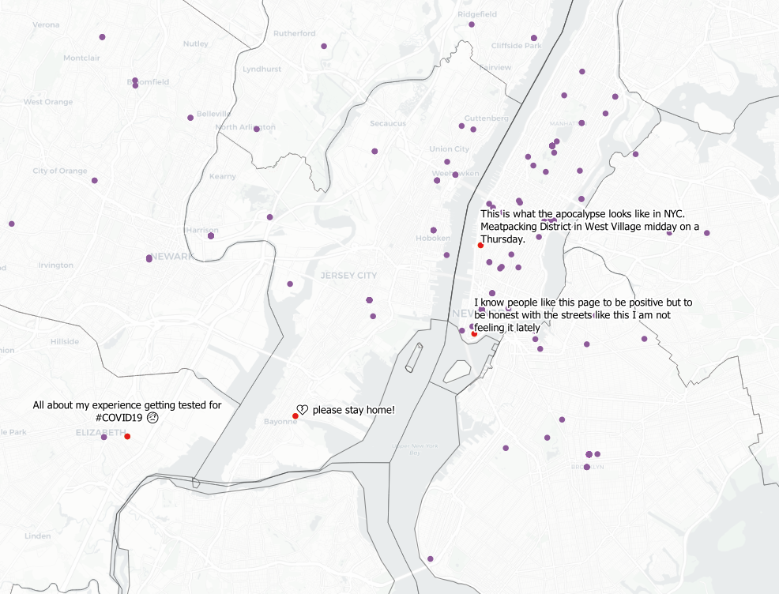
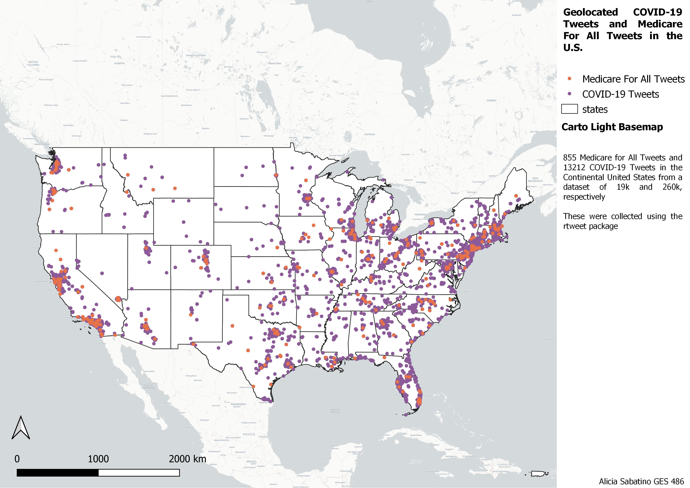
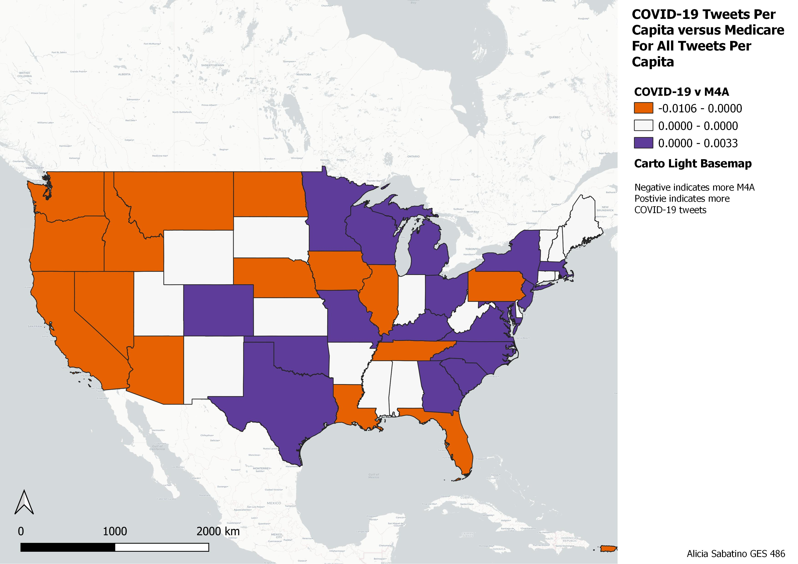

# Lab 6: Mapping COVID-19 using Twitter Data

I made various maps using twitter data in conjunction with COVID-19 Data from the New York Times.

---

## 1. COVID-19 Tweets Through Time

I collected several million tweets using rtweet that contained either "covid19" or "covid19" from March 20,2020 to March 27, 2020.

[insert gimp photo]

There were around 250k tweets per day collected, which were then narrowed down to tweets with location data. 

---

## 2. COVID-19 Tweets at the U.S. County Level
### Next I looked at Tweets by County
[]
[insert map of tweets by county ]
### Then I got data on COVID-19 Cases by County 
[insert map of covid-cases w counties]
### Then I compared COVID-19 Tweet Share by County to COVID-19 Case by County
[insert map comparing share]

These were based on one collection of 270k tweets, which were then narrowed down to about 14k by selecting for ones with geolocation data. 

These tweets spanned March 25 - March 27.

Note: I will also be adding one adjusted for population.

---

## 3. Comparing COVID-19 Tweets to Medicare for All tweets by State
### Click either image to open a web map!

---

---

COVID-19 tweet data was collected using rtweet. Tweets contained either "covid19" or "covid19" from March 25,2020 to March 27, 2020.
Medicare for All tweets contained either "MedicareForAll" (the popular hashtag) or "Medicare for All" (the phrase) from March 25, 2020 to March 27. 2020.

There were 14k COVID-19 tweets and 900 Medicare for All tweets with location data.The tweets were adjusted for population.

---

## 4. Comparing Medicare for All Tweets to COVID-19 Cases

[insert map comparing share of COVID-19 Cases to share of medicare for all tweets]

This map compares a state's COVID-19 Cases share to its Medicare for All tweet share.
I hope to also create a map containing these shares adjusted with population.

