# Project 3 | GES 486 | Alicia Sabatino

## Introduction
The history of mass incarceration in the United States begins with the "end" of slavery: the ammendment to the Consitution that abolished slavery in the United States, also enabled the state to control people who have committed crimes as property. In the south, where a majority of enslaved people were held, incarceration boomed. Eventually, incarceration rates across the country rose as "tough on crime" policies were implemented and corporate prisons formed super PACs and put forth legislation.

Recently, there has been a shift in the geography of incarceration in the United States. Prisons are now increasingly incarcerating more people who have not been convicted of a crime. This trend holds on average for the United States.

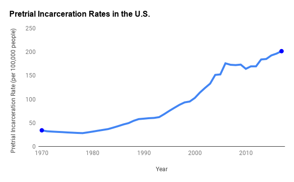

In addition, there has been a shift in the geography of incarceration. In the mid 2000s rural coutnies started to have higher incarceration rates than urban counties.

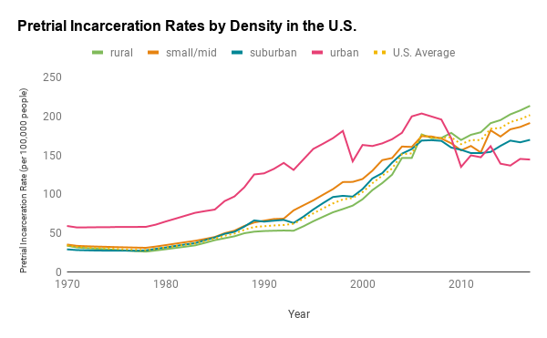

The U.S. Census categorizes counties as urban, small/mid metropolitan, suburban, and rural as a way to classify density. Additionally, the U.S. Census divides the country up into the South, the Northeast, the West, and the Midwest. This project aims to examine the rural incarceration boom, and determine whether this rural shift occured in all regions of the United States.

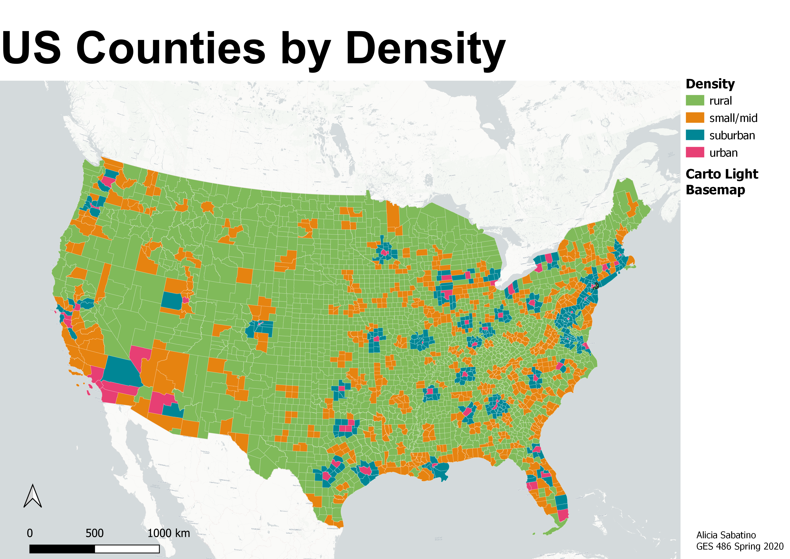
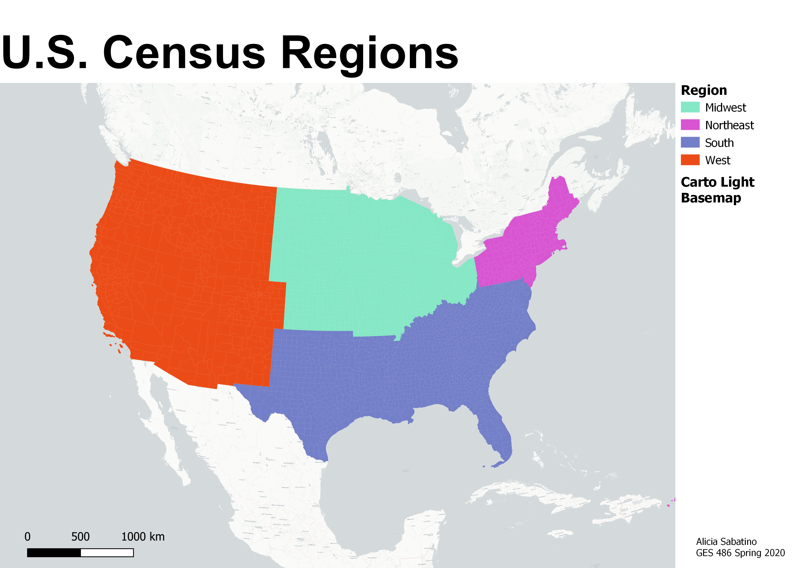

Incarceration Rates in the United States have trended signifcantly upward since the 80s.

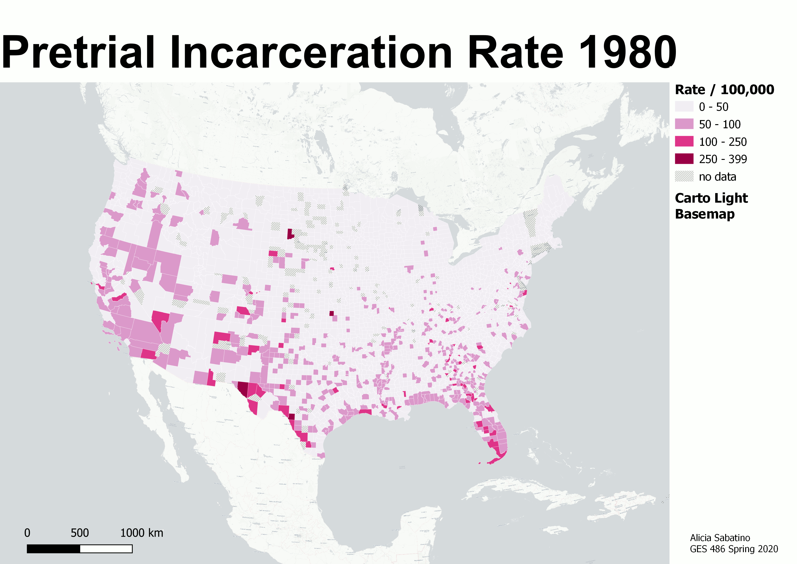

Currently, there are 7,067 incarceration facilities in the United States. Click the link to see the facility on a map along with the number of inmates, region, and density of the location.

[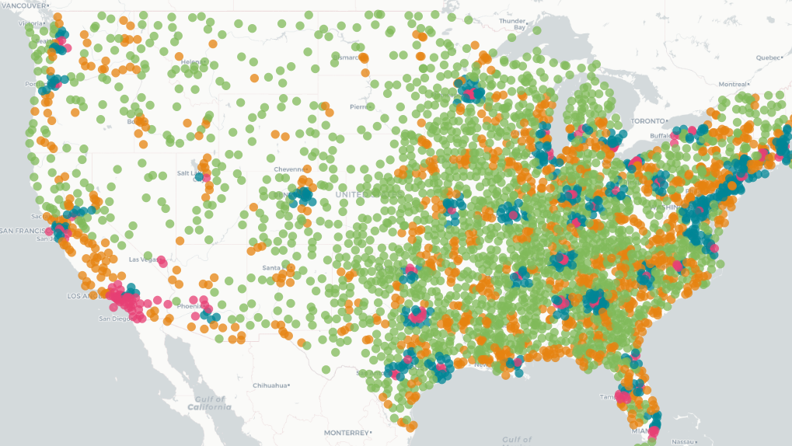](http://nerdjpg.github.io/projects/project3/qgis2web_2020_05_14-14_20_26_721882/index.html)
This project uses county-level data across a 45 year span to examine spatial shifts in incarceration rates in the United States.

## Methods
This project used data from the [United States Census Bureau](https://www.census.gov/developers/) and the Vera Institute of Justice for this project. The Vera Institute of Justice compiled an Incarceration Trends dataset, which is freely available on [their github page](https://github.com/vera-institute/incarceration_trends).  

The data was transformed and and queried in R. R was also used to created plots and shapefiles to visualize the shift in incarceration in the United States. 

To determine a statistical relationship, the coefficient of determination was used. In the south, R-sqaured was _ In the northeast, R-squared was , incidating a negative correlation. 

## Results
### Density shift by Region
As previously shown the overall trend for the United States as a whole is a sharper increase in pretrial incarceration in rural areas when compared to urban areas. However, for each region, this pattern does not hold.

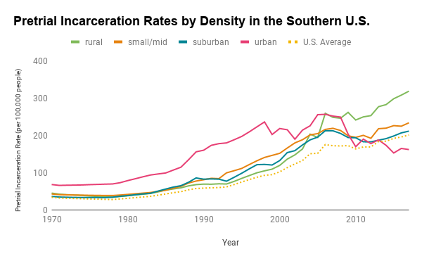
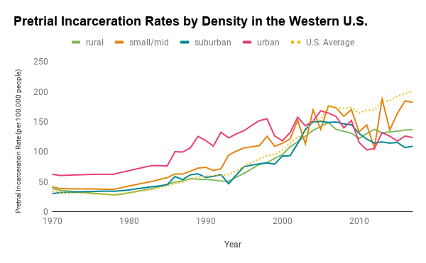
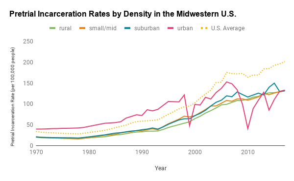
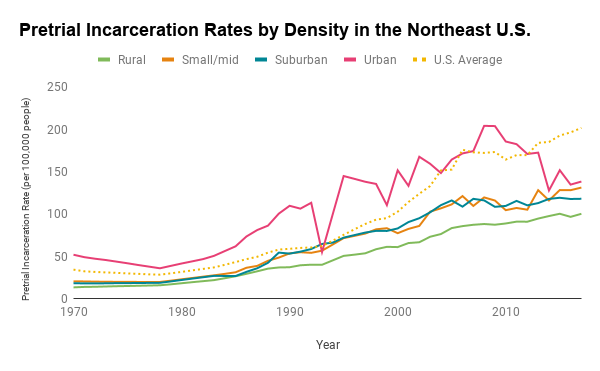

Interestingly, while the final incarceration rates for the south show a large increase in pre-trial incarceration in the South, if one looks at percent increase from 2005 to 2015, the largest increase on average is in the Midwest.

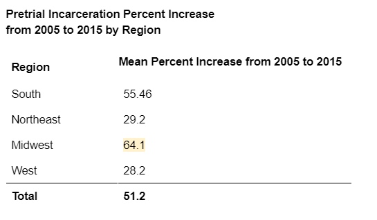

### Percent Increase Or Decrease

The shift in places of incarceration occured in the mid to late 2010s, as shown by the previous charts. To view this change interactively, click the  map below.

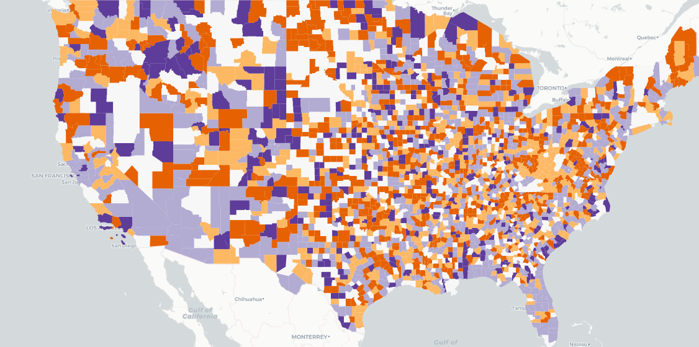

## Discussion

There are many possibile explanations for this trend being region specific. Prisons are spaces of labor. It is possible this geography emerged from the type of labor incarcerated people in that region are made to engage in. In the South, there are more incarcerated people doing agricultural work. 

This should be investigated further and controlled for other variables. 

